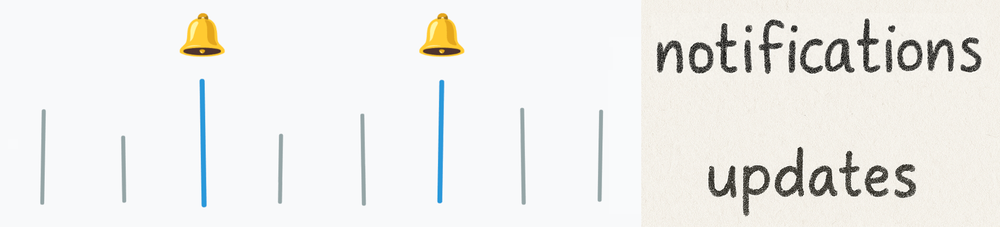
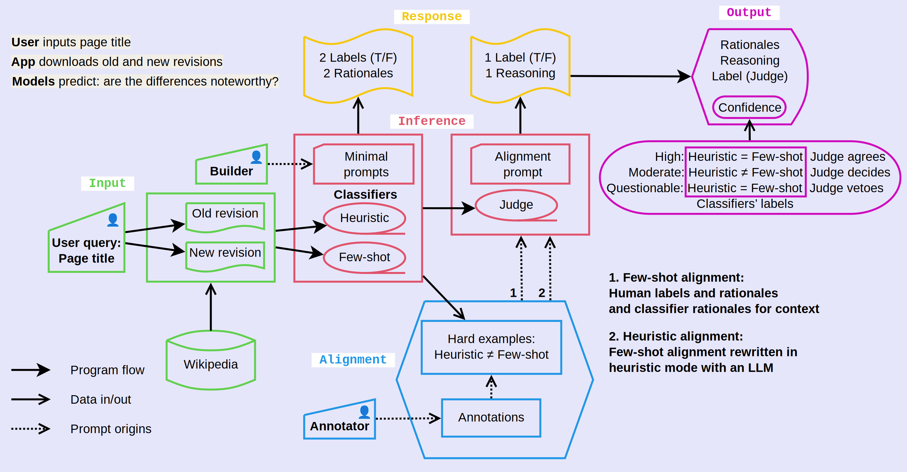

# Noteworthy Differences

Noteworthy differences are important in many situations.
A goal of alignment is to train AI systems to detect changes that humans think are noteworthy.
For example, project documents are frequently updated but you only want notifications for big changes.
The specific data used in this project are old and new revisions of Wikipedia articles.

  

This project implements an AI alignment pipeline with a multi-level architecture (classifiers and judge) and two alignment stages (development and production).
The architecture provides a label with reasoning together with a confidence score.
The multiple alignment stages provide for continuous learning.

Summary of the architecture:

- Classifiers with two different prompts (heuristic and few-shot) are used to:
  - Label differences between the revisions as noteworthy or not
  - Generate rationales for the classification
- The output is sent to an AI judge to make the final call
- For each query, the level of agreement among the classifiers and judge is used for the confidence score

Summary of the development pipeline:

- Examples where the classifiers *disagree* are forwarded to the human annotator
  - This allows the annotator to focus on a small number of hard examples
- The annotator's labels and rationales are used to align an AI judge
  - The unaligned AI judge has minimal prompt instructions
  - The few-shot AI judge has a prompt with the annotator's rationales and labels
    - The prompt also includes the classifers' rationales to provide a summary of differences between revisions
  - The heuristic AI judge has a prompt made by rewriting the rationales and labels in heuristic mode with an LLM
- Evalulations are made on the unaligned and aligned AI judges
  - The test data is an independent set of hard examples with human annotations as ground truth

After developing the initial heuristic alignment prompt, it is further refined in production through human feedback.

## Usage

**Web UI:** Run `python app.py` for a Gradio frontend.

**Python:** See [usage-examples.md](usage-examples.md) for examples of retrieving Wikipedia page revisions and running classifier and judge models.

**Pytest:** Tests are provided in `test_models.py` and are run with GitHub Actions.

## AI alignment pipeline

There are two stages: development and production.
In the development stage, we create an initial alignment from human annotation.
In the production stage, we fine-tune the alignment through user feedback.

Stage 1: Development

All scripts and output files are in the `development` directory (except for the first round of the heuristic alignment, which is saved under `production`).
Run the pipeline with different Main Pages (step 1) to make the training and test sets.
Skip the Alignment step for evaluations with the test set.
 
1. **Initial preparation:** Run `get_titles.R` to extract and save the page titles linked from the Wikipedia Main Page to `wikipedia_titles.txt`.
*This is optional; do this to use a newer set of page titles than the ones provided here.*
  
2. **Collect data:** Run `collect_data.py` to retrieve revision id, timestamp, and page introductions for 0, 10, and 100 revisions before current.
The results are saved to `wikipedia_introductions.csv`.

3. **Create examples:** Run `create_examples.py` to run the classifier and save the results to `examples.csv`.
The model is run up to four times for each example:
two prompt styles (heuristic and few-shot) and two revision intervals (between current and 10th and 100th previous revisions, if available).

4. **Human annotation:** Run `extract_disagreements.R` to extract the examples where the heuristic and few-shot models disagree.
These are saved in `disagreements_for_human.csv` (only Wikipedia introductions) and `disagreements_for_AI.csv` (introductions and classifier responses).
*Without looking at the classifier responses*,
the annotator fills in the `noteworthy` (True/False) and `rationale` columns in the for-human CSV file and saves it as `human_alignments.csv`.

5. **Unaligned AI judge:** Run `judge_disagreements.py` to run the unaligned judge on the examples where the models disagree.
The results are saved to `AI_judgments_unaligned.csv`.

6. **Alignment:** Run `align_judge.R` to collect the alignment data into `alignment_fewshot.txt`.
The alignment text consist of True/False labels and rationales from the human annotator and rationales from the classifiers.

7. **Evaluate:** Run `judge_disagreements.py --aligned-fewshot` to run the aligned judge on the examples where the models disagree;
the results are saved to `AI_judgments_fewshot.csv`.

8. **Rewrite alignment:**
A heuristic prompt created by rewriting the alignment text using an LLM is in `production/alignment_1.txt`.
Run `judge_disagreements.py --aligned-heuristic` to evaluate this judge.
Then run `summarize_results.R` to compute the summary statistics for all judges (results listed below).

Stage 2: Production

All output files are in the `production` directory.

- We start with an alignment prompt developed above; this is the first round (`alignment_1.txt`)
- Collect user feedback on the hard examples (where confidence score is not High)
- Hard examples can be found by using the "🎲 Special Random" button in the app
- The app stores feedback in train/test split with a 60/40 ratio
- The feedback is stored in a [Hugging Face Dataset](https://huggingface.co/datasets/jedick/noteworthy-differences-feedback)
- Accumulate 30 train examples for each round of fine-tuning
- Use `update_alignment.py` to update the heuristic alignment prompt with feedback examples
- The new alignment prompt is saved as `alignment_{round}.txt` (round = 2, 3, 4, ...)

For each alignment, we run evaluations on the current and all previous rounds of the test sets.

- Run `evaluate()` in `evaluate.py` with the corresponding arguments:
  - evalset (1 is development, 2+ is production)
  - alignment round (0 is unaligned, 1 is development, 2+ is production)
  - evaluation rep (we take the average of 3 repetitions)
- The results are stored in `evaluations` and are visualized below

## Development Results

| | Train samples | Test samples | Train accuracy | Test accuracy |
| --- | --- | --- | --- | --- |
| Wikipedia pages | 163 | 91 |  |  |
| Total revisions (10 and 100 behind) | 303 | 167 |  |  |
| Noteworthy classifications by: |  |  |  |  |
| &emsp;Heuristic classifier | 90 | 53 |  |  |
| &emsp;Few-shot classifier | 110 | 62 |  |  |
| Disagreements between classifiers | 26 | 19 |  |  |
| &emsp;Noteworthy classifications by: |  |  |  |  |
| &emsp;&emsp;Human annotator | 16 | 8 |  |  |
| &emsp;&emsp;Unaligned AI judge | 25 | 18 | 58% | 37% |
| &emsp;&emsp;Few-shot AI judge | 18 | 16 | 92% | 47% |
| &emsp;&emsp;Heuristic AI judge | 23 | 15 | 65% | 53% |

### Discussion

- The few-shot and heuristic classifiers agree on most classifications (ca. 90%)
- For revisions where the classifiers disagree ("hard examples"):
  - The unaligned AI judge classifies the great majority as noteworthy
  - The human annotator is variable (62% for train samples vs 42% for test samples)
- The few-shot AI judge **overfits**
  - Alignment prompt contains the annotator's rationales
  - 34% improvement in train accuracy but only 10% improvement in test accuracy
- The heuristic AI judge **generalizes**
  - Alignment prompt rewritten in heuristic mode with Claude
  - 7% improvement in train accuracy and 16% improvement in test accuracy
- Accuracy scores are for the hard examples, not the entire dataset
  - Lower performance on test set may be due to concept drift (i.e., annotator fatigue)
